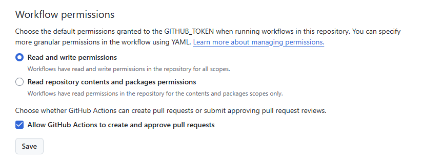

# Déploiement

1. configurer Vite

    ```js
    // @file vite.config.js
    export default defineConfig({
        base: '/devops-s03-deploy/', // nom du dépôt
        plugins: [svelte()],
        // ...
    })
    ```

2. ajouter le _workflow_

    ```yml
    # @file .github/workflows/deploy.yml
    name: Deploy to GitHub Pages

    on:
      push:
        branches: [main]
        
    jobs:
      build-and-deploy:
        runs-on: ubuntu-latest
        steps:
          - uses: actions/checkout@v2
          
          # Installation de Node.js
          - name: Setup Node.js
            uses: actions/setup-node@v2
            with:
              node-version: '20'
          
          # Installation des dépendances
          - name: Install dependencies
            run: npm ci
          
          # Exécution des tests
          - name: Run tests
            run: npm run test
          
          # Build de l'application
          - name: Build
            run: npm run build
          
          # Déploiement sur GitHub Pages
          - name: Deploy to GitHub Pages
            uses: JamesIves/github-pages-deploy-action@v4.1.5
            with:
              branch: gh-pages
              folder: dist
    ```

3. configurer GitHub : dans `Settings > Actions > General > Workflows permissions`

    

4. exécuter le _workflow_ en publiant sur la branche `main`

5. activer les GitHub Pages dans `Settings > Pages` :
   choisir la branche `gh-pages` et enregistrer

→ le site devrait être accessible à l'adresse :  
<https://votre_pseudo.github.io/votre_projet/>

> avec, ici, `votre projet` = `devops-s03-deploy`    
